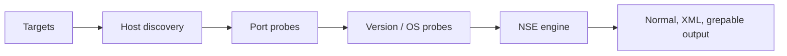

# Nmap

Nmap is a network-discovery, port-state inference, service-fingerprinting, and scriptable enumeration platform. Its output is evidence about packets and responses—not proof of vulnerability.

> [!warning] Scope first
> Scan only approved addresses and rates. Use reserved examples such as `192.0.2.0/24` in documentation; replace them only with an engagement allowlist.



## Installation and verification

```shell-session
operator@lab:~$ sudo apt install nmap
operator@lab:~$ nmap --version | head -n 2
Nmap version 7.95 ( https://nmap.org )
Platform: x86_64-pc-linux-gnu
```

Use the official package for the platform and record `nmap --version`; script behavior can change with the bundled NSE library.

## Target and discovery controls

| Area | Important flags |
|---|---|
| Targets | single IP, CIDR, range, `-iL file`, `--exclude`, `--excludefile` |
| Discovery | `-sn`, `-Pn`, `-PS`, `-PA`, `-PU`, `-PE`, `-PP`, `-PM`, `-PR`, `-n`, `-R` |
| Address family | `-4`, `-6` |
| List only | `-sL` |

`-Pn` means “skip discovery and treat hosts as up”; it does not make a scan stealthy. `-n` avoids reverse-DNS latency and data leakage. Always combine broad inputs with exclusions.

## Scan techniques and ports

| Technique | Flag | Interpretation |
|---|---|---|
| TCP SYN | `-sS` | SYN-ACK open, RST closed, silence/filter indication |
| TCP connect | `-sT` | OS completes `connect()`; no raw privileges needed |
| UDP | `-sU` | Response open, ICMP unreachable closed, silence ambiguous |
| ACK | `-sA` | Maps filtering/statefulness, not open ports |
| FIN/NULL/Xmas | `-sF`, `-sN`, `-sX` | RFC-response inference; unreliable on some stacks |
| SCTP | `-sY`, `-sZ` | INIT or COOKIE-ECHO techniques |

Port selection: `-p 22,80,443`, `-p-`, `--top-ports 1000`, `-F`, `--exclude-ports`, `-r` sequential order. Service/OS: `-sV`, `--version-intensity 0-9`, `--version-light`, `--version-all`, `-O`, `--osscan-limit`, `--osscan-guess`, `-A`.

## Timing, packet, and routing controls

`-T0` through `-T5` select timing templates. Precise controls include `--min-rate`, `--max-rate`, `--min-parallelism`, `--max-parallelism`, `--scan-delay`, `--max-scan-delay`, `--host-timeout`, `--max-retries`, `--min-rtt-timeout`, and `--max-rtt-timeout`. Use `--reason`, `--packet-trace`, `--traceroute`, `-e interface`, `-S source`, and `--source-port` only when the test design requires them. Fragmentation (`-f`, `--mtu`), decoys (`-D`), bad checksums (`--badsum`), data-length changes, and spoofing alter attribution or filtering behavior and require explicit RoE approval.

## NSE

```shell-session
operator@lab:~$ nmap -sV -p 22,80,443 --script 'default and safe' --script-timeout 30s 192.0.2.10 -oA evidence/web01
Nmap scan report for 192.0.2.10
PORT    STATE  SERVICE VERSION
22/tcp  open   ssh     OpenSSH 9.6
80/tcp  closed http
443/tcp open   https   nginx 1.24
```

Select scripts with `--script`, pass arguments with `--script-args`, inspect help with `--script-help`, and update the script database with `--script-updatedb`. Script categories include `default`, `safe`, `discovery`, `auth`, `vuln`, `intrusive`, and `dos`; category labels are guidance, not a substitute for review.

## Output and reproducibility

`-oN` writes human text, `-oX` XML, `-oG` legacy grepable, and `-oA base` all three. `-v/-vv`, `-d`, `--stats-every 30s`, `--open`, `--resume`, and `--append-output` support operations. XML is preferable for pipelines.

```shell-session
operator@lab:~$ nmap -sn -n -iL approved.txt --excludefile excluded.txt --max-rate 50 -oA evidence/discovery
Nmap done: 14 IP addresses (9 hosts up) scanned in 8.42 seconds
operator@lab:~$ sha256sum evidence/discovery.*
2ea1...  evidence/discovery.gnmap
701c...  evidence/discovery.nmap
a8d0...  evidence/discovery.xml
```

Validate surprising states with packet capture or a second technique; load balancers, proxies, tarpits, and host firewalls can distort fingerprints.

## Crook2Root mastery lab

Build a two-host range containing one Linux server and one firewall. Run four passes and explain every difference instead of merely collecting ports:

```shell-session
operator@range:~$ nmap -sn -n 192.0.2.0/28 --reason -oA evidence/01-discovery
Nmap done: 16 IP addresses (2 hosts up) scanned in 2.31 seconds
operator@range:~$ sudo nmap -sS -Pn -p- --max-rate 100 --reason 192.0.2.10 -oA evidence/02-tcp
PORT    STATE    SERVICE REASON
22/tcp  open     ssh     syn-ack ttl 64
80/tcp  closed   http    reset ttl 64
443/tcp filtered https   no-response
operator@range:~$ sudo nmap -sU -p53,123,161 --version-intensity 2 192.0.2.10 -oA evidence/03-udp
53/udp  open          domain
123/udp open|filtered ntp
161/udp closed        snmp
```

Capture the run with a narrow packet filter, identify SYN/SYN-ACK/RST and ICMP unreachable responses, then change one firewall rule and repeat. The final deliverable is a state-explanation table containing packet evidence, Nmap reason, confidence, and the validating technique.

## Troubleshooting & false confidence

- **Everything appears filtered:** verify route, VPN, source address, host discovery assumptions, and upstream ACLs. Test one known-open service with `-sT`.
- **Service fingerprint is wrong:** inspect `--version-trace`, TLS SNI/virtual-host requirements, proxy behavior, and banner deception.
- **Results change between runs:** compare packet loss, timing, load balancers, dynamic cloud addresses, and intrusion-prevention rate controls.
- **Local resource errors:** reduce parallelism/rate and inspect file-descriptor, conntrack, and ephemeral-port exhaustion.
- **XML parser loses findings:** retain original XML, schema/version metadata, and unknown fields; do not scrape human output.

## Defensive visibility

Discovery produces recognizable fan-out, incomplete handshakes, unusual flag combinations, NSE application requests, and sequential destination-port patterns. During purple-team validation, correlate scanner source, firewall flow logs, packet telemetry, target service logs, and alert timestamps. Success means the assessment evidence and defensive evidence describe the same activity.

---
> 🔼 Up: [[Network Discovery Tools]]
