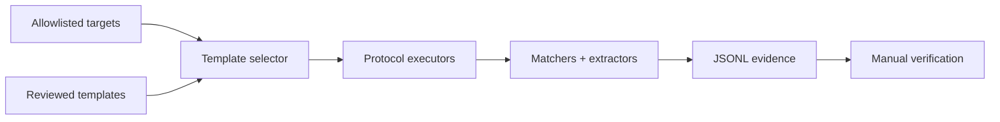

# Nuclei

Nuclei executes declarative templates against targets and emits structured matches. Its strength is reproducible checks; its risks are unsafe templates, excessive requests, stale signatures, and treating pattern matches as verified findings.



## Installation and template hygiene

```shell-session
operator@lab:~$ nuclei -version
[INF] Nuclei Engine Version: v3.x
operator@lab:~$ nuclei -ut
[INF] nuclei-templates are up to date
```

Install a pinned official binary, verify checksums, and review template changes like code. Record both engine and template commit/version.

## Input and selection

| Area | Important flags |
|---|---|
| Targets | `-u`, `-l`, `-im`, `-exclude-hosts` |
| Templates | `-t`, `-w`, `-nt`, `-ntv`, `-validate`, `-tl` |
| Selection | `-tags`, `-etags`, `-itags`, `-id`, `-eid`, `-severity`, `-es` |
| Protocol | `-pt`, `-ept`, `-passive`, headless/code toggles by version |
| Rate | `-rl`, `-rlm`, `-c`, `-bs`, `-timeout`, `-retries`, `-mhe` |
| Output | `-jsonl`, `-o`, `-sresp`, `-srd`, `-silent`, `-stats`, `-si` |
| Network | `-proxy`, `-r` resolvers, `-iv`, `-ni`, TLS/SNI options |

High-risk template capabilities such as headless browser actions, code execution, file access, or fuzzing require explicit enablement and review. Never run an untrusted template repository with privileged local access.

## Controlled run

```shell-session
operator@lab:~$ nuclei -l approved-urls.txt -tags exposure,misconfig -severity medium,high,critical \
  -rl 10 -c 5 -timeout 5 -retries 1 -jsonl -o evidence/nuclei.jsonl -stats
[INF] Targets loaded: 4
[INF] Templates clustered: 218 (Reduced 611 Requests)
[medium] [http] [missing-security-headers] https://app.example.test
[INF] Scan completed in 00:00:24
```

## Anatomy of a safe custom template

```yaml
id: c2r-training-header-check
info:
  name: C2R Training Header Check
  author: security-engineering
  severity: info
  tags: training,headers
http:
  - method: GET
    path:
      - "{{BaseURL}}/health"
    max-redirects: 2
    matchers:
      - type: word
        part: header
        words: ["X-C2R-Training"]
    extractors:
      - type: kval
        part: header
        kval: ["x_c2r_training"]
```

```shell-session
operator@lab:~$ nuclei -validate -t c2r-header.yaml
[INF] All templates validated successfully
operator@lab:~$ nuclei -u https://app.example.test -t c2r-header.yaml -jsonl
{"template-id":"c2r-training-header-check","matched-at":"https://app.example.test/health",...}
```

Use multiple matchers to reduce false positives, avoid state-changing methods by default, and document matcher limitations. A template match should enter a triage queue with raw evidence, asset ownership, affected version, and manual validation status.

## Template engineering depth

Templates can model HTTP, DNS, TCP, SSL/TLS, file, headless, JavaScript, and code workflows depending on engine policy. Enterprise repositories should separate passive/informational checks, safe active checks, authentication-required checks, and high-risk templates into independently approved workflows.

Use DSL matchers for relationships between status, length, headers, and extracted values. Prefer deterministic protocol evidence over product banners. Extractors are for evidence and workflow variables; redact tokens before writing results.

```yaml
matchers-condition: and
matchers:
  - type: status
    status: [200]
  - type: dsl
    dsl:
      - 'contains(to_lower(header), "application/json")'
      - 'contains(body, "C2R-TRAINING")'
```

## Authenticated workflows

Secrets should enter through protected environment/config integration, not committed templates. Validate that login succeeded using a unique authenticated marker and define what happens when a token expires halfway through a run. Avoid sharing cookies across unrelated hosts.

## Crook2Root template lab

Create a disposable service with vulnerable, fixed, and deceptive versions. Write one template, test all three, and require: zero false positives, captured evidence, bounded requests, timeout behavior, and a clear remediation reference.

```shell-session
operator@lab:~$ nuclei -t c2r-check.yaml -l fixtures.txt -rl 2 -jsonl | jq -r '[."matched-at",."matcher-name"] | @tsv'
https://vulnerable.example.test	marker-and-version
operator@lab:~$ nuclei -validate -t templates/
[INF] All templates validated successfully
```

## Failure analysis

No match can mean redirects, virtual-host/SNI mismatch, authentication loss, matcher overconstraint, template protocol mismatch, or rate limiting. A false match often comes from generic strings, unanchored regexes, shared edge pages, or status-only logic. Save representative responses in a controlled test fixture and build regression tests before deployment.

---
> 🔼 Up: [[Vulnerability Assessment Tools]]
