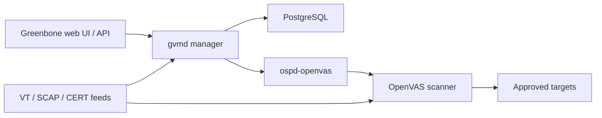

# OpenVAS

OpenVAS is the scanning engine within Greenbone Vulnerability Management. A typical deployment separates web UI, manager/database, scanner, feeds, and task orchestration.



## Installation and health

Distribution packaging differs. On a supported security distribution, install the GVM packages, initialize feeds and services, then run the platform’s setup check.

```shell-session
admin@scanner:~$ sudo gvm-check-setup
Step 1: Checking OpenVAS (Scanner)... OK
Step 2: Checking GVMD Manager ... OK
Step 3: Checking certificates ... OK
It seems like your GVM installation is OK.
```

Do not expose the web interface publicly. Restrict it, use trusted TLS, back up the database, and monitor feed synchronization.

## Objects and workflow

| Object | Purpose |
|---|---|
| Port list | Defines TCP/UDP coverage |
| Credential | Enables local security checks |
| Target | Hosts, exclusions, ports, alive-test behavior |
| Scan config | Vulnerability-test families and preferences |
| Scanner | Execution backend |
| Task | Binds target, scanner, config, schedule, alerts |
| Report | Results, QoD, severity, evidence, overrides |

```shell-session
admin@scanner:~$ sudo greenbone-feed-sync --type NVT
Downloading Notus and NASL vulnerability tests...
Feed sync complete.
admin@scanner:~$ gvmd --get-scanners
08b69003-5fc2-4037-a479-93b440211c73  OpenVAS Default
```

CLI names and supported options vary by GVM release; use `--help` and the matching administrator documentation.

## Quality of Detection and credentials

Greenbone’s Quality of Detection communicates how directly a test supports a result. Prefer authenticated local checks and direct protocol observations over banner-only inference. Track credential status, SSH privilege elevation, Windows remote-registry/WMI requirements, and scan-user permissions.

```text
Host: 192.0.2.20
VT: Example outdated package
QoD: 97% (authenticated package inventory)
Severity: 8.1
Evidence: package example-1.2.3 installed; fixed in 1.2.7
Verification: asset owner confirmed repository and update path
```

Tune simultaneous hosts/checks to the weakest asset class, separate fragile devices, define exclusions, and avoid disruptive VTs without explicit approval. Export structured reports for ticketing but preserve the original immutable report ID and feed timestamp.

## Greenbone administration workflow

Feed state, scanner connectivity, manager database health, certificates, and queue depth all affect results. Record them before a regulated scan.

```shell-session
admin@scanner:~$ gvmd --get-scanners
08b69003-5fc2-4037-a479-93b440211c73  OpenVAS Default
admin@scanner:~$ sudo gvm-check-setup | tail -n 2
It seems like your GVM installation is OK.
admin@scanner:~$ date -u
Thu Jul 30 11:00:00 UTC 2026
```

For automation, use GMP/GVM client libraries with a least-privileged account. Treat XML responses as versioned schemas, protect report data, and use stable target/task UUIDs rather than matching display names.

## Crook2Root scan lab

Create two targets for the same host: one unauthenticated and one with a restricted credential. Compare detected software, local security checks, QoD, runtime, and false positives. Then intentionally remove one privilege and identify how the report signals partial credential coverage.

## Overrides & acceptance

An override changes presentation, not underlying evidence. Require finding ID, asset scope, rationale, reviewer, expiration, compensating control, and revalidation date. Do not globally suppress a VT because one asset is a false positive.

## Troubleshooting

- Empty task: target/alive-test conflict, scanner unavailable, feed initialization, or port-list error.
- Very low QoD: banner-only inference, blocked local checks, or incomplete credentials.
- Manager/scanner mismatch: verify OSP connectivity, certificates, sockets, and service identities.
- Long report import: inspect PostgreSQL resources, report size, feed processing, and disk.
- Stale vulnerability data: validate every feed type and synchronization timestamp, not just NVT download success.

Enterprise metrics include reachable-asset coverage, credentialed-check success, feed age, QoD distribution, overrides approaching expiry, scan duration, and confirmed-to-reported ratio.

---
> 🔼 Up: [[Vulnerability Assessment Tools]]
