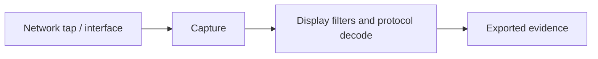

# Packet Analysis Tools

Capture and inspect wire evidence while preserving timestamps, interfaces, snap length, loss statistics, and cryptographic provenance.



- [[Wireshark]]
- [[tcpdump]]

```shell-session
analyst@sensor:~$ sha256sum capture.pcapng
891d...  capture.pcapng
```

---
> 🔼 Up: [[Defensive Tools]]
