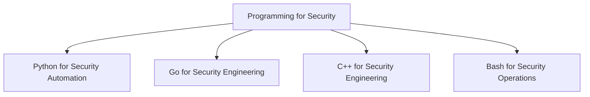

# Programming for Security

> [!abstract] Engineering branch
> Languages and engineering practices for safe automation, high-performance utilities, and composable operator workflows.



## Language paths

- [[Python]]
- [[Go]]
- [[C++]]
- [[Bash]]

## Practical selection

```text
Need rapid API or evidence automation?  -> Python
Need a portable concurrent binary?      -> Go
Need systems-level memory and ABI work?  -> C++
Need to compose existing Unix controls? -> Bash
```

---
> 🔼 Up: [[Tooling & Scripting]]
