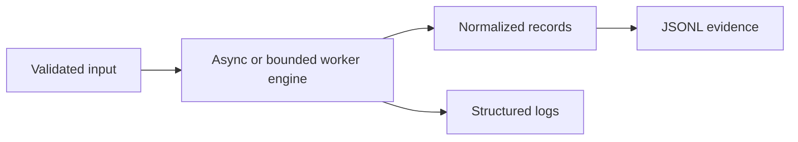

# Python for Security Automation

Python excels at API integration, evidence normalization, protocol prototyping, and repeatable analysis. Production security scripts need the same input validation, testing, observability, and secret handling as backend services.



## Reproducible environment

```shell-session
analyst@lab:~$ python3 -m venv .venv
analyst@lab:~$ . .venv/bin/activate
(.venv) analyst@lab:~$ python -m pip install --upgrade pip
Successfully installed pip-26.1
(.venv) analyst@lab:~$ python -m pip freeze > requirements.lock
```

Pin dependencies, scan them, and never put tokens in source. Prefer `pathlib`, `ipaddress`, `secrets`, `ssl`, `hashlib`, `logging`, `json`, and `argparse` from the standard library.

## Bounded asynchronous probe

```python
import argparse, asyncio, ipaddress, json, time

async def probe(host: str, port: int, limit: asyncio.Semaphore) -> dict:
    started = time.monotonic()
    async with limit:
        try:
            reader, writer = await asyncio.wait_for(
                asyncio.open_connection(host, port), timeout=1.0)
            writer.close(); await writer.wait_closed()
            state = "open"
        except (TimeoutError, OSError):
            state = "closed-or-filtered"
    return {"host": host, "port": port, "state": state,
            "elapsed_ms": round((time.monotonic() - started) * 1000)}

async def main(host: str) -> None:
    ipaddress.ip_address(host)              # reject ambiguous input
    limit = asyncio.Semaphore(32)           # explicit resource ceiling
    results = await asyncio.gather(*(probe(host, p, limit) for p in (22, 80, 443)))
    for row in results: print(json.dumps(row, sort_keys=True))

if __name__ == "__main__":
    ap = argparse.ArgumentParser(); ap.add_argument("host")
    asyncio.run(main(ap.parse_args().host))
```

```shell-session
(.venv) analyst@lab:~$ python probe.py 192.0.2.10
{"elapsed_ms": 4, "host": "192.0.2.10", "port": 22, "state": "open"}
{"elapsed_ms": 1002, "host": "192.0.2.10", "port": 80, "state": "closed-or-filtered"}
{"elapsed_ms": 8, "host": "192.0.2.10", "port": 443, "state": "open"}
```

## Engineering details

- Separate collection, parsing, enrichment, and presentation so each can be tested.
- Use `requests.Session` or `httpx.AsyncClient` for connection reuse; always set connect/read timeouts.
- Treat certificates deliberately: use a trusted CA bundle rather than silencing TLS verification.
- Stream large files and emit JSONL so interrupted work remains usable.
- Return stable exit codes: `0` success, `2` usage error, another documented code for partial collection.
- Mock network boundaries in unit tests and run integration tests only against disposable fixtures.

```python
def redact(headers: dict[str, str]) -> dict[str, str]:
    hidden = {"authorization", "cookie", "set-cookie", "x-api-key"}
    return {k: "<redacted>" if k.lower() in hidden else v for k, v in headers.items()}
```

This redaction must happen before serialization and logging—not after evidence has already leaked.

## HTTP, TLS & API engineering

Use one client/session, explicit connect/read/write/pool timeouts, bounded redirects, trusted CA bundles, response-size limits, retry policies restricted to idempotent operations, and typed validation of JSON. A `200` response can still be an application error.

```python
import httpx

limits = httpx.Limits(max_connections=20, max_keepalive_connections=10)
timeout = httpx.Timeout(connect=3, read=5, write=5, pool=3)
with httpx.Client(verify=True, timeout=timeout, limits=limits,
                  headers={"User-Agent": "C2R-Auditor/1.0"}) as client:
    response = client.get("https://app.example.test/health")
    response.raise_for_status()
    body = response.json()
    if body.get("status") != "ok": raise RuntimeError("unhealthy application state")
```

## Binary & packet work

Use `bytes`, `bytearray`, `memoryview`, `struct`, and explicit endianness. Validate lengths before unpacking. Scapy is powerful for authorized packet labs, but packet generation needs scope/rate gates and packet-capture verification.

## Packaging, typing & tests

Use `pyproject.toml`, isolated builds, locked dependencies, console entry points, type checking, linting, unit tests, property tests, and fuzzing for parsers. Do not rely on the current working directory; use package resources and explicit paths.

```shell-session
engineer@lab:~$ python -m pytest -q --disable-warnings
42 passed in 1.18s
engineer@lab:~$ mypy src
Success: no issues found in 12 source files
engineer@lab:~$ ruff check .
All checks passed!
```

## Crook2Root master project

Build an authenticated API posture collector with configuration schema, secret-provider interface, allowlisted hosts, async concurrency, pagination, backoff, TLS validation, redaction, JSONL evidence, metrics, cancellation, and resumable checkpoints. Mock API failures, fuzz JSON normalization, run an integration fixture, generate an SBOM, and publish a signed package.

## Failure analysis

Event-loop blocking comes from synchronous calls inside async tasks. Memory spikes come from gathering unbounded responses. Hung runs indicate missing timeouts/cancellation. Unicode/bytes bugs arise at protocol boundaries. Nondeterministic tests often depend on wall clock, DNS, global environment, or unordered concurrency—inject those dependencies.

---
> 🔼 Up: [[Programming for Security]]
