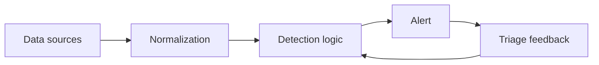

# SIEM & Detection Engineering Tools

Search, correlation, portable detection logic, testing, deployment, and feedback from investigations.



- [[Splunk Basics]]
- [[Sigma]]

```text
rule -> test corpus -> platform conversion -> deployment -> alert review -> tuning
```

---
> 🔼 Up: [[Defensive Tools]]
