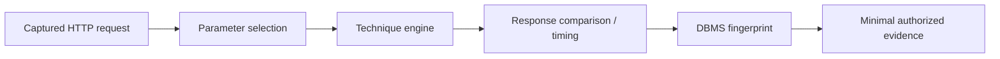

# SQLmap

SQLmap automates SQL-injection detection, DBMS fingerprinting, and bounded evidence collection. Its capability surface is broad; begin with detection-only settings and never request data or operating-system interaction beyond explicit authorization.



## Installation

```shell-session
operator@lab:~$ python3 -m pipx install sqlmap
operator@lab:~$ sqlmap --version
1.9.x
```

Pin a release for reproducibility. Prefer a saved raw request from the test proxy rather than reconstructing complex authentication on the command line.

## Input & request controls

| Area | Important options |
|---|---|
| Target | `-u`, `-r request.txt`, `-l proxy.log`, `-m bulk.txt`, `-g dork` (rarely appropriate) |
| Parameter | `-p`, `--skip`, `--param-exclude`, `--cookie`, `--data`, `--method`, `--headers`, `-H` |
| HTTP | `--proxy`, `--proxy-file`, `--timeout`, `--retries`, `--delay`, `--random-agent`, `--force-ssl` |
| Session | `--flush-session`, `--fresh-queries`, `--session-file`, `--traffic-file` |
| Detection | `--level 1-5`, `--risk 1-3`, `--technique BEUSTQ`, `--dbms`, `--prefix`, `--suffix` |
| Comparison | `--string`, `--not-string`, `--regexp`, `--code`, `--text-only`, `--titles` |
| Performance | `--threads`, `--time-sec`, `--predict-output`, `--keep-alive`, `--null-connection` |
| Output | `--output-dir`, `--results-file`, `-v 0-6`, `--batch` |

Techniques: Boolean-based blind (`B`), error-based (`E`), UNION query (`U`), stacked queries (`S`), time-based blind (`T`), and inline queries (`Q`). `--risk` increases potentially state-changing test forms; keep it at the lowest useful level.

## Safe detection example

```shell-session
operator@lab:~$ sqlmap -r evidence/search-request.txt -p q --level 2 --risk 1 \
  --technique=BEUT --delay 0.2 --threads 1 --output-dir evidence/sqlmap
[INFO] testing connection to the target URL
[INFO] testing if GET parameter 'q' is dynamic
[INFO] GET parameter 'q' appears to be dynamic
[WARNING] heuristic test shows that GET parameter 'q' might not be injectable
[INFO] testing 'AND boolean-based blind - WHERE or HAVING clause'
[INFO] parameter 'q' does not seem to be injectable
```

Negative automated output is not proof of safety; context, encoding, second-order behavior, and business workflow still matter.

## Enumeration boundaries

Fingerprint options include `--banner`, `--current-user`, `--current-db`, `--hostname`, `--is-dba`, and `--users`. Database/table/column enumeration, dumps, file reads/writes, UDFs, shells, registry access, and takeover options are increasingly invasive. Use a canary database fixture where possible and stop after the minimum evidence. Never use broad `--dump-all` or destructive SQL in enterprise validation.

## Tamper scripts & evasion

`--tamper` transforms payloads. It can produce misleading results, evade monitoring, or change parser behavior and therefore requires explicit WAF-testing approval. Record script order and source. Prefer understanding canonicalization manually over stacking transformations blindly.

Preserve raw traffic, SQLmap logs, session database, exact command, version, parameter choice, and a manual reproduction. Redact cookies and credentials before sharing evidence.

## Technique interpretation

- **Boolean-based blind:** compare true/false predicates while controlling dynamic page noise.
- **Error-based:** database errors return structured query data; verify they originate from the intended backend.
- **UNION-based:** requires compatible column count/types and visible output context.
- **Stacked queries:** may permit additional statements and therefore carry state-change risk.
- **Time-based blind:** relies on statistical timing differences; network jitter and queues create false conclusions.
- **Out-of-band:** requires approved DNS/HTTP interaction infrastructure and is highly environment-dependent.

## Dynamic-content calibration

Use `--string`, `--not-string`, `--regexp`, or `--code` when pages contain timestamps, rotating tokens, advertisements, or personalized content. Compare repeated baseline requests before choosing a marker. For time-based tests, collect baseline distributions and use conservative thresholds rather than one delayed response.

```text
Baseline samples (ms): 112, 119, 108, 131, 116
Candidate samples (ms): 5118, 5109, 5127
Interpretation: strong differential, pending manual controlled reproduction
```

## Crook2Root lab

Deploy MySQL/PostgreSQL fixtures with safe injectable and parameterized endpoints. Capture the same request, run detection at low risk, explain each technique chosen, and compare DBMS fingerprints. Fix the application, flush the session, and require a clean retest. Add a noisy dynamic field to learn response-comparison tuning.

## Troubleshooting

- Parameter not dynamic: select the actual server-consumed input and confirm a controlled value change.
- False timing result: increase samples, reduce concurrent load, measure jitter, and reproduce manually.
- Authentication expires: use a test-session refresh process and verify login state during the run.
- WAF blocks traffic: stop and coordinate the dedicated WAF methodology; do not blindly stack tamper scripts.
- Session cache misleads retest: use `--flush-session` or an isolated output directory and preserve both runs.
- Wrong DBMS: remove forced fingerprinting and inspect response/protocol evidence.

---
> 🔼 Up: [[Web Application Testing Tools]]
