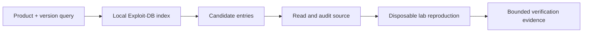

# SearchSploit

SearchSploit is an offline search client for the Exploit Database archive. It finds candidate research artifacts; it does not establish applicability, safety, code quality, or authorization.



## Installation and database maintenance

```shell-session
analyst@lab:~$ sudo apt install exploitdb
analyst@lab:~$ searchsploit -u
[i] Updating exploit database...
[i] SearchSploit database updated
```

## Search and output flags

| Purpose | Flag |
|---|---|
| Case-sensitive search | `-c` |
| Exact title match | `-e` |
| Exclude terms | `--exclude term` |
| Ignore web paths | `--ignore` where supported |
| JSON output | `-j`, `--json` |
| Nmap XML correlation | `--nmap file.xml` |
| Show exploit source | `-x path-or-id` |
| Copy to working directory | `-m path-or-id` |
| Show path | `-p id` |
| Searchsploit help | `-h` |
| Titles only / overflow controls | version-specific short flags shown in help |

```shell-session
analyst@lab:~$ searchsploit --json "Example Server 4.2" | jq '.RESULTS_EXPLOIT[] | {Title,Path}'
{
  "Title": "Example Server 4.2 - Authentication Bypass",
  "Path": "exploits/example/remote/12345.py"
}
analyst@lab:~$ searchsploit -x 12345
Exploit: Example Server 4.2 - Authentication Bypass
URL: https://www.exploit-db.com/exploits/12345
```

## Safe analysis workflow

Read the entire source before running it. Search for network destinations, shell execution, file writes, destructive actions, hard-coded callbacks, dependency downloads, architecture assumptions, and target version checks. Recreate it in an isolated lab, compare the vulnerable code path or patch, and add timeouts and instrumentation.

```shell-session
analyst@lab:~/review$ cp /usr/share/exploitdb/exploits/example/remote/12345.py candidate.py
analyst@lab:~/review$ sha256sum candidate.py
d174...  candidate.py
analyst@lab:~/review$ rg -n 'subprocess|os\.system|socket|requests|unlink|remove' candidate.py
18:import socket
57:sock.connect((target, port))
```

A matching title can still be irrelevant because of backported patches, compile options, authentication prerequisites, deployment topology, or incorrect version detection. Cite the original advisory and CVE, not only a database entry.

## PoC review worksheet

Before execution, answer:

| Question | Required evidence |
|---|---|
| What exact vulnerable code path is exercised? | Advisory, patch diff, or source analysis |
| What prerequisites exist? | Version, architecture, configuration, auth, network position |
| What changes on the target? | Files, processes, accounts, memory, restart/crash risk |
| Where does data leave the lab? | Every hostname, IP, URL, callback, dependency |
| How is success distinguished from damage? | Stable success predicate and health check |
| How is state restored? | Cleanup command plus owner verification |

## Static & dynamic review

```shell-session
analyst@lab:~/review$ file candidate.py
candidate.py: Python script, ASCII text executable
analyst@lab:~/review$ python3 -m py_compile candidate.py
analyst@lab:~/review$ rg -n 'eval|exec|subprocess|system|unlink|rmtree|http' candidate.py
57:subprocess.run(command, timeout=5)
```

Run suspicious code only in an isolated, monitored environment with blocked Internet egress and disposable targets. Capture process, file, and network behavior. Replace hard-coded external destinations and destructive actions with canary fixtures before reproduction.

## Version-correlation lab

Search one product by exact version, broad product name, and Nmap XML. Compare results, then trace one candidate through CVE record, vendor advisory, patch, and local code. The outcome should be “applicable,” “not applicable,” or “unknown with required evidence”—never “exploit found, therefore vulnerable.”

## Troubleshooting

No results may indicate naming differences or a stale local archive; excessive results mean the query is too broad. Numeric IDs and paths can shift between package layouts, so preserve the database revision and copied artifact hash. If code fails, debug assumptions rather than weakening target safety controls.

---
> 🔼 Up: [[Vulnerability Assessment Tools]]
