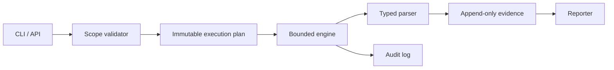
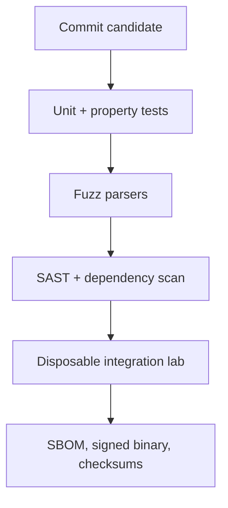

# Security Tool Architecture & Design Patterns

A reliable security tool is a controlled evidence pipeline, not a pile of payloads. Its architecture must make scope, rate, identity, provenance, failure, and rollback visible.



## Core patterns

| Pattern | Purpose | Failure it prevents |
|---|---|---|
| Command pattern | Represent each operation as validated data | Hidden side effects |
| Adapter | Isolate external APIs and protocols | Vendor lock-in and brittle tests |
| Strategy | Swap scan or parse behavior | Giant conditional logic |
| Producer/consumer | Bound concurrency with queues | Resource exhaustion |
| Circuit breaker | Stop after repeated dependency failure | Runaway retries |
| Append-only event log | Preserve provenance and replay | Unverifiable findings |
| Capability boundary | Separate privileged helpers | Whole-process compromise |

## Execution manifest

```json
{
  "run_id": "20260730T090000Z-6e8c",
  "operator": "assessment-team",
  "scope": ["192.0.2.0/28"],
  "exclusions": ["192.0.2.7/32"],
  "rate_per_second": 50,
  "tool_version": "1.4.2",
  "dry_run": false
}
```

Validate CIDRs before execution, make exclusions higher precedence than inclusions, and hash the manifest into every result. Structured logs should go to stderr; machine-readable findings should go to stdout or a named output file.

```shell-session
operator@lab:~$ secprobe plan --config run.yaml --dry-run
PLAN OK  targets=14 excluded=1 max_rate=50/s operations=42
operator@lab:~$ secprobe run --config run.yaml --output results.jsonl
RUN COMPLETE attempted=42 succeeded=40 failed=2 duration=4.81s
```

## Security and quality gates

Threat-model SSRF, command injection, parser bombs, unbounded decompression, credential leakage, path traversal, and malicious target responses. Fuzz every parser boundary. Redact secrets before logs, use explicit timeouts, and support cancellation without corrupting output. A dry run must resolve exactly what would happen without contacting targets.



---
> 🔼 Up: [[Writing Your Own Tools]]
