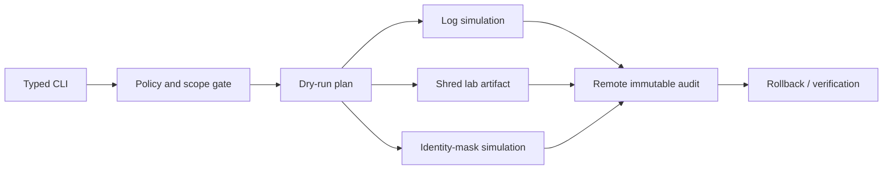
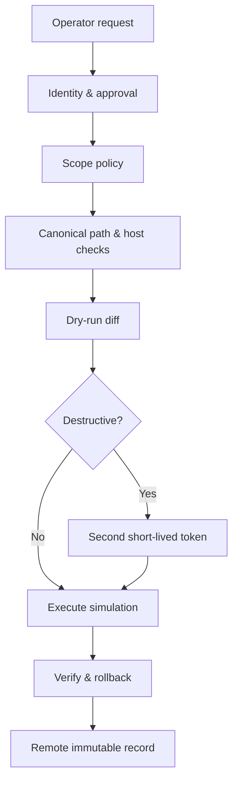

# ShadowStep Tool Architecture

> [!warning] Incident-response training and controlled red-team simulation
> ShadowStep is an open-source Python anti-forensics simulator. Potentially destructive modules must run only on disposable range hosts or client-authorized artifacts. Production evidence preservation and legal holds override cleanup requests.

ShadowStep models log manipulation, data shredding, and network-identity masking so defenders can validate tamper detection, immutable logging, recovery, and attribution controls.



## Safe-by-default interface

```shell-session
responder@range:~$ shadowstep plan --profile ir-lab.yaml --dry-run
SAFE PLAN  host=range-ubuntu-04 actions=3 destructive=1 rollback=available
responder@range:~$ shadowstep simulate logs --fixture /srv/range/auth.log --marker C2R-IR-44
SIMULATED  records=2 fixture_only=true audit_id=ss-44a1
responder@range:~$ shadowstep verify --audit-id ss-44a1
remote_audit=present fixture_restored=true marker_detected_by_siem=true
```

## Architecture rules

- Resolve and canonicalize every path; deny system log locations unless a disposable-lab policy explicitly allows them.
- Require dry-run output and a short-lived approval token for destructive modules.
- Send pre-action and post-action events to a remote append-only sink that the endpoint cannot modify.
- Preserve a cryptographic manifest and rollback copy for fixtures.
- Refuse mounted evidence, legal-hold paths, production profiles, and unknown hosts.
- Treat “secure deletion” claims carefully: copy-on-write filesystems, SSD wear leveling, snapshots, and remote replicas can retain data.

```json
{"audit_id":"ss-44a1","module":"logs","target_class":"fixture","pre_hash":"a18c...","post_hash":"e6b2...","rollback":"verified","siem_alert":"C2R-IR-44"}
```

## Defensive acceptance test

The exercise succeeds only if endpoint monitoring records process and file activity, remote logging preserves original events, the SIEM detects the marker/tamper sequence, and recovery restores a trusted state. The tool’s value is measurable defense validation, not disappearance.

## Threat model

Assume malformed paths, symlink races, mount changes, compromised local administrators, forged approval tokens, interrupted actions, partial rollback, and unavailable remote audit. ShadowStep must never claim it can defeat immutable logging, storage snapshots, forensic acquisition, or hardware behavior.



## Module contracts

Every module implements `plan`, `precheck`, `execute`, `verify`, and `rollback`. Plans list resolved targets, expected changes, risk, privileges, evidence, and rollback. Execution receives open file descriptors or validated objects rather than re-resolving attacker-controlled strings.

### Log manipulation simulator

Operate on generated fixtures by default. Preserve original hash, parse format, apply marker-specific transformations, write atomically, verify parser readability, emit remote audit, then restore. Binary accounting databases require format-aware fixture handlers—not truncation.

### Data shredding simulator

Teach the difference between logical overwrite and assured destruction. On SSD, copy-on-write, snapshots, journaling, RAID, cloud volumes, and remote backup, overwriting a pathname cannot prove physical erasure. Enterprise destruction relies on cryptographic erasure, lifecycle controls, and media destruction policies.

### Network identity masking simulator

Use isolated namespaces/range interfaces and reversible settings. A test can change a lab MAC, hostname, or egress route while remote sensors preserve attribution. Refuse production management interfaces and verify connectivity before/after rollback.

## Policy example

```yaml
environment: disposable-range
allowed_hosts: [range-ubuntu-04]
allowed_roots: [/srv/shadowstep-fixtures]
deny_mount_types: [nfs, cifs, fuse, overlay]
remote_audit_required: true
destructive_approval_ttl_seconds: 120
max_file_bytes: 10485760
rollback_required: true
```

## Incident-response training scenario

```shell-session
responder@range:~$ shadowstep plan --profile ir-lab.yaml --scenario indicator-removal
actions=4 fixtures=3 remote_audit=reachable rollback=ready status=SAFE
responder@range:~$ shadowstep run --plan plan-7f2.json --approval-token REDACTED
START audit=ss-7f2 module=logs target=/srv/shadowstep-fixtures/auth.log
VERIFY local_marker_removed=true remote_original_present=true siem_alert=IR-2044
ROLLBACK hash_restored=true parser_check=passed
```

The blue team should detect file replacement/truncation, process access to audit artifacts, identity changes, remote-log continuity differences, and attempted deletion. The exercise fails if remote audit is absent or rollback is unverified.

## Testing & release

Property-test path containment, fuzz parsers, simulate power loss between every state transition, test symlink swaps, verify atomic writes, and run only in disposable integration images. Release with signed packages, SBOM, documented platform limits, and conspicuous safety defaults. Telemetry bypass is not a feature.

---
> 🔼 Up: [[Writing Your Own Tools]]
