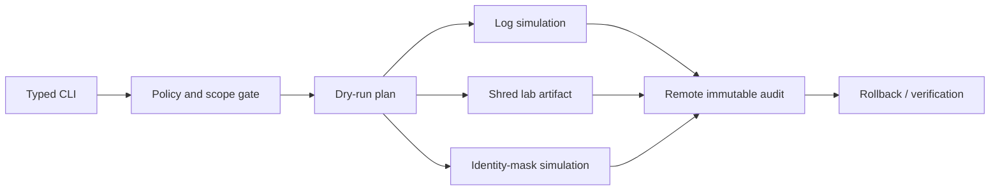

# ShadowStep Tool Architecture

> [!warning] Incident-response training and controlled red-team simulation
> ShadowStep is an open-source Python anti-forensics simulator. Potentially destructive modules must run only on disposable range hosts or client-authorized artifacts. Production evidence preservation and legal holds override cleanup requests.

ShadowStep models log manipulation, data shredding, and network-identity masking so defenders can validate tamper detection, immutable logging, recovery, and attribution controls.



## Safe-by-default interface

```shell-session
responder@range:~$ shadowstep plan --profile ir-lab.yaml --dry-run
SAFE PLAN  host=range-ubuntu-04 actions=3 destructive=1 rollback=available
responder@range:~$ shadowstep simulate logs --fixture /srv/range/auth.log --marker C2R-IR-44
SIMULATED  records=2 fixture_only=true audit_id=ss-44a1
responder@range:~$ shadowstep verify --audit-id ss-44a1
remote_audit=present fixture_restored=true marker_detected_by_siem=true
```

## Architecture rules

- Resolve and canonicalize every path; deny system log locations unless a disposable-lab policy explicitly allows them.
- Require dry-run output and a short-lived approval token for destructive modules.
- Send pre-action and post-action events to a remote append-only sink that the endpoint cannot modify.
- Preserve a cryptographic manifest and rollback copy for fixtures.
- Refuse mounted evidence, legal-hold paths, production profiles, and unknown hosts.
- Treat “secure deletion” claims carefully: copy-on-write filesystems, SSD wear leveling, snapshots, and remote replicas can retain data.

```json
{"audit_id":"ss-44a1","module":"logs","target_class":"fixture","pre_hash":"a18c...","post_hash":"e6b2...","rollback":"verified","siem_alert":"C2R-IR-44"}
```

## Defensive acceptance test

The exercise succeeds only if endpoint monitoring records process and file activity, remote logging preserves original events, the SIEM detects the marker/tamper sequence, and recovery restores a trusted state. The tool’s value is measurable defense validation, not disappearance.

---
> 🔼 Up: [[Writing Your Own Tools]]
