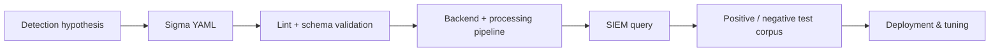
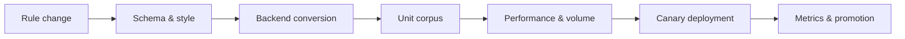

# Sigma

Sigma is a vendor-neutral YAML rule format for expressing log-detection logic. A backend converts the rule into a target query language, but field mappings, pipeline transformations, and platform semantics still require testing.



## Tooling installation

Use a maintained Sigma CLI/converter implementation and pin its backend/plugin versions.

```shell-session
engineer@lab:~$ pipx install sigma-cli
engineer@lab:~$ sigma version
Sigma CLI version 1.x
engineer@lab:~$ sigma plugin list | head
Installed plugins:
```

CLI syntax and plugin names change; inspect `sigma --help` for the installed release. Common operations cover rule checking, plugin installation/listing, conversion, target selection, processing pipelines, output formats, and directory recursion.

## Rule anatomy

```yaml
title: C2R Canary Process From Script Host
id: 62045966-3035-4a7a-b940-2b019bf95e42
status: test
description: Detects an authorized purple-team canary process chain.
author: Detection Engineering
date: 2026-07-30
logsource:
  category: process_creation
  product: windows
detection:
  parent:
    ParentImage|endswith:
      - '\\wscript.exe'
      - '\\cscript.exe'
  child:
    Image|endswith: '\\whoami.exe'
  condition: parent and child
falsepositives:
  - Approved administration scripts
level: medium
tags:
  - attack.execution
```

Modifiers include `contains`, `startswith`, `endswith`, `re`, `cidr`, `base64`, `base64offset`, `windash`, `all`, and existence/comparison variants supported by the specification/backend. Conditions can combine selections with Boolean logic, `1 of`, `all of`, and aggregations where supported.

## Convert & test

```shell-session
engineer@lab:~$ sigma check rules/c2r-canary.yml
Checking rule validity ... OK
engineer@lab:~$ sigma convert -t splunk -p sysmon rules/c2r-canary.yml
((ParentImage="*\\wscript.exe" OR ParentImage="*\\cscript.exe") Image="*\\whoami.exe")
```

Conversion success does not prove field availability or query correctness. Run the generated query against known-positive canary events and negative production-like data; compare event counts and inspect raw fields.

## Rule quality

Use stable IDs, meaningful titles, explicit logsource, references, false-positive guidance, severity, tags, and status lifecycle (`experimental`, `test`, `stable`, `deprecated`). Keep environmental allowlists outside core detection where possible. CI should validate YAML/schema, duplicate IDs, backend conversion, test corpora, and rule metadata. Track data-source prerequisites and expected event volume.

## Detection semantics

`logsource` describes category/product/service; a processing pipeline maps abstract fields into a concrete platform. Conversion cannot invent data that was never collected. Lists within one field commonly mean OR, while separate fields in one selection commonly mean AND—verify specification and converter behavior.

Use multiple selections for behavior, narrow filters for known benign patterns, and explicit conditions. Anchor regular expressions and benchmark them. Keep environment allowlists separate from portable core logic when practical.

## Test corpus

Every rule needs canonical positives; case/path/quoting/parent variations; near-miss negatives; benign administration; missing-field cases; and expected conversions for supported backends.

```text
positive/canary-powershell-whoami.json
positive/canary-pwsh-whoami.json
negative/cmd-whoami.json
negative/powershell-get-process.json
negative/missing-parent-image.json
```



Measure true positives, investigated false positives, alerts/day, distinct entities, query runtime, skipped runs, and data-source coverage. Suppressions need owner, reason, scope, and expiry.

## Mastery lab

Write one process rule and convert it to two backends. Compare generated fields, replay identical events, and explain differences. Remove a required field and prove coverage failure with a data-quality alert.

---
> 🔼 Up: [[SIEM & Detection Engineering Tools]]
