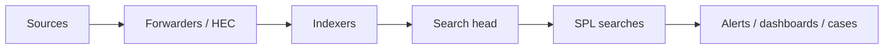

# Splunk Basics

Splunk indexes timestamped events and provides Search Processing Language (SPL), dashboards, alerts, data models, and distributed search. Security value begins with correct time, source type, field extraction, access control, and data-quality monitoring.



## Architecture & ingestion

Universal Forwarders collect files/Event Logs; Heavy Forwarders can parse and route; HTTP Event Collector accepts token-authenticated events; indexers parse/store searchable buckets; search heads coordinate searches. In clusters, managers coordinate indexer/search-head members. Protect management and HEC endpoints with trusted TLS and least-privileged roles.

```shell-session
admin@splunk:~$ $SPLUNK_HOME/bin/splunk status
splunkd is running (PID: 1842).
splunk helpers are running (PIDs: 1843).
admin@splunk:~$ $SPLUNK_HOME/bin/splunk btool inputs list --debug | head
/opt/splunk/etc/apps/c2r/local/inputs.conf [monitor:///var/log/auth.log]
```

Common CLI actions include `start`, `stop`, `restart`, `status`, `enable boot-start`, `add monitor`, `add forward-server`, `list forward-server`, `show config`, and `btool`. Avoid secrets on command lines; use managed configuration and secret storage.

## SPL pipeline

Search efficiently by constraining index, time, source type, and selective fields first:

```spl
index=endpoint earliest=-15m sourcetype="XmlWinEventLog:Microsoft-Windows-Sysmon/Operational" EventCode=1
| eval image=lower(Image), parent=lower(ParentImage)
| stats count min(_time) as firstTime max(_time) as lastTime values(CommandLine) as commands by host user image parent
| where count >= 3
| convert ctime(firstTime) ctime(lastTime)
```

| SPL family | Examples |
|---|---|
| Transform | `stats`, `chart`, `timechart`, `top`, `rare` |
| Filter | `search`, `where`, `regex`, `dedup`, `head` |
| Shape | `fields`, `rename`, `table`, `sort`, `fillnull` |
| Enrich | `lookup`, `inputlookup`, `outputlookup` |
| Multivalue | `mvexpand`, `mvindex`, `mvfilter`, `makemv` |
| Time | `bin`, `bucket`, `convert ctime`, relative time modifiers |
| Data models | `tstats`, accelerated models, CIM fields |

## Investigation example

```spl
index=network earliest=-1h (dest_port=22 OR dest_port=3389)
| stats dc(dest_ip) as targets count as attempts values(action) as actions by src_ip user
| where targets > 10 OR attempts > 50
| sort - attempts
```

```text
src_ip       user        targets attempts actions
192.0.2.44   test-user   18      74       failure
```

This is a triage lead, not proof. Validate asset role, scanner allowlists, NAT, account ownership, and raw events.

## Operational discipline

Monitor ingestion delay, missing hosts, parsing failures, timestamp skew, license volume, skipped searches, search concurrency, and retention. Use summary indexing/data-model acceleration only after validating semantic equivalence. Version-control detections, test them against positive/negative corpora, and attach runbooks with severity, owner, suppression boundaries, and rollback.

---
> 🔼 Up: [[SIEM & Detection Engineering Tools]]
