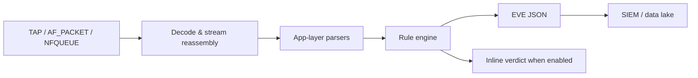

# Suricata

Suricata is a multithreaded IDS/IPS/network-security-monitoring engine. It decodes flows and application protocols, evaluates signatures, and emits EVE JSON for alerts, flow, DNS, HTTP, TLS, files, and other telemetry.



## Installation & validation

```shell-session
analyst@sensor:~$ sudo apt install suricata
analyst@sensor:~$ suricata --build-info | head
This is Suricata version 7.x
analyst@sensor:~$ sudo suricata -T -c /etc/suricata/suricata.yaml
Configuration provided was successfully loaded. Exiting.
```

Never reload untested configuration on an inline sensor. Use the vendor/community update tool, pin rule sources, inspect changes, and stage them against recorded traffic.

## Important CLI controls

| Purpose | Options |
|---|---|
| Config/test | `-c`, `-T`, `--dump-config`, `--list-keywords`, `--list-app-layer-protos` |
| Live capture | `-i`, `--af-packet`, `--pcap`, `-q` NFQUEUE, `--netmap`, platform-specific modes |
| Offline | `-r file-or-directory`, `--pcap-file-continuous` |
| Rules | `-S` exclusive rule file, `-s` additional file |
| Logging | `-l` log directory, `--set key=value`, verbosity flags |
| Runtime | `--runmode`, `--engine-analysis`, `--pidfile`, user/group dropping |

## Rule anatomy

```suricata
alert http $HOME_NET any -> $EXTERNAL_NET any (
  msg:"C2R authorized training marker observed";
  flow:established,to_server;
  http.uri; content:"/c2r-training-marker"; nocase;
  classtype:policy-violation;
  sid:9000001; rev:1;
)
```

Rule headers define action, protocol, addresses, and ports. Options select flow direction/state, sticky buffers, content/PCRE, byte operations, thresholds, flowbits, metadata, references, `sid`, and `rev`. Use local SID ranges and unique ownership.

```shell-session
analyst@sensor:~$ suricata -r fixtures/c2r-marker.pcap -S rules/local.rules -l output
30/7/2026 -- 10:31:14 - <Notice> - all 1 packet processing threads initialized
analyst@sensor:~$ jq 'select(.event_type=="alert") | [.timestamp,.src_ip,.alert.signature]' output/eve.json
[
  "2026-07-30T10:31:13.420000+0000",
  "192.0.2.44",
  "C2R authorized training marker observed"
]
```

## Sensor engineering

Define `HOME_NET`, checksum policy, stream depth, memcaps, capture threads, CPU affinity, rule profiling, and EVE event types according to the link. Monitor packet drops, decoder events, flow emergency mode, capture bypass, disk pressure, and timestamp drift. TLS encryption limits payload visibility but metadata remains valuable.

For IPS, test fail-open/fail-closed behavior, asymmetric routing, maintenance bypass, verdict latency, and rollback. A rule promotion pipeline should compile/test, replay positive and negative pcaps, benchmark performance, deploy canary sensors, and monitor alert volume.

---
> 🔼 Up: [[Network Detection & Monitoring Tools]]
