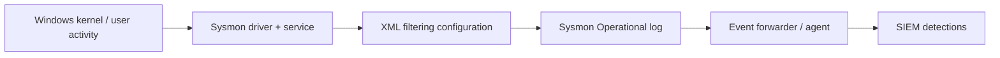

# Sysmon

Sysmon is a Sysinternals Windows service and driver that records security-relevant endpoint activity to `Microsoft-Windows-Sysmon/Operational`. It enriches—but does not replace—Windows auditing or EDR telemetry.



## Installation & lifecycle

Download from Microsoft Sysinternals, verify the digital signature, review the license and configuration, then deploy through managed software distribution.

```powershell
PS C:\Tools\Sysmon> .\Sysmon64.exe -accepteula -i .\sysmon-config.xml
System Monitor v15.x - System activity monitor
Sysmon installed.
SysmonDrv installed.
Starting SysmonDrv.
Sysmon started.
PS C:\Tools\Sysmon> .\Sysmon64.exe -c
Current configuration:
 - Service name: Sysmon64
 - Driver name: SysmonDrv
```

Key switches include `-i [config]` install, `-c [config]` inspect/update, `-u [force]` uninstall, `-s` print schema, `-? config` configuration help, and `-accepteula`. Test exact syntax against the installed version.

## Important event families

| Event ID | Meaning |
|---:|---|
| 1 | Process creation with hashes, parent, command line |
| 2 | File creation time changed |
| 3 | Network connection when enabled |
| 6 / 7 | Driver / image loaded |
| 8 / 10 | CreateRemoteThread / process access |
| 11 | File create |
| 12–14 | Registry object/value activity |
| 15 | FileCreateStreamHash, including alternate streams |
| 17–18 | Named pipe creation/connection |
| 19–21 | WMI filter, consumer, binding |
| 22 | DNS query |
| 23 / 26 | File delete archived / logged |
| 25 | Process tampering |
| 29 | File executable detected |

Availability and fields depend on Sysmon version.

## Configuration model

```xml
<Sysmon schemaversion="4.90">
  <HashAlgorithms>sha256,imphash</HashAlgorithms>
  <EventFiltering>
    <ProcessCreate onmatch="exclude">
      <Image condition="is">C:\Windows\System32\conhost.exe</Image>
    </ProcessCreate>
    <NetworkConnect onmatch="include">
      <DestinationPort condition="is">445</DestinationPort>
    </NetworkConnect>
  </EventFiltering>
</Sysmon>
```

Understand `onmatch`, include/exclude precedence, compound rules, field conditions, and schema version. Start broad in a lab, measure event volume, then exclude only proven noise. An exclusion is a visibility decision and needs an owner, rationale, and expiry review.

## Query & validation

```powershell
PS C:\> Get-WinEvent -FilterHashtable @{LogName='Microsoft-Windows-Sysmon/Operational'; Id=1; StartTime=(Get-Date).AddMinutes(-5)} |
  Select-Object -First 1 TimeCreated,Id,Message
TimeCreated          Id Message
-----------          -- -------
7/30/2026 10:20:14 AM 1 Process Create: ... Image: C:\Windows\System32\whoami.exe ...
```

Validate configuration changes with benign canary actions and confirm collection at the SIEM. Monitor service/driver health, log channel capacity, forwarder backlog, config hash, and unexpected Event ID 4 service-state changes.

---
> 🔼 Up: [[Endpoint Telemetry Tools]]
