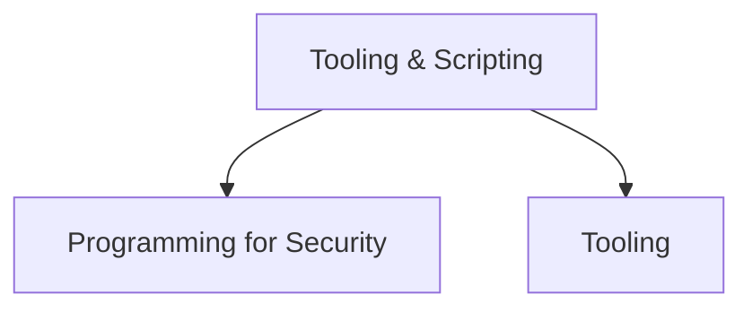

# 🧰 Tooling & Scripting

> [!abstract] The Domain
> Building and wielding tools — Python & Go for security, and the core pentest toolkit. Part of the domain map at [[Cyber Security]].

## Two trunks



- [[Programming for Security]]
- [[Tooling]]

```shell-session
engineer@workstation:~$ printf '%s\n' programming tooling
programming
tooling
```

---
> 🌐 Back to the domain map: [[Cyber Security]]
