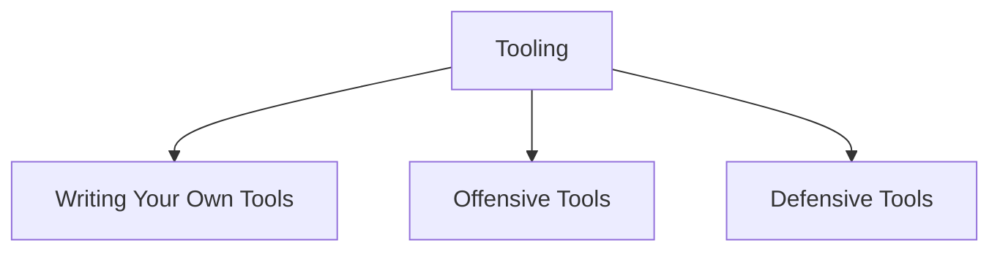

# Tooling

> [!abstract] The Armory
> Build tools, operate authorized assessment tools, and instrument defensive visibility. Methodology remains in its operational domain; this branch documents the instruments themselves.



## Armory branches

- [[Writing Your Own Tools]]
- [[Offensive Tools]]
- [[Defensive Tools]]

## Operator baseline

```shell-session
operator@lab:~$ mkdir -p run/{config,raw,normalized,logs}
operator@lab:~$ printf '%s\n' 'scope=192.0.2.0/28' 'owner=security-team' > run/config/engagement.env
operator@lab:~$ sha256sum run/config/engagement.env
85ac35...  run/config/engagement.env
```

Every tool run should have a version, immutable input scope, timestamp, output path, rate profile, and named owner.

---
> 🔼 Up: [[Tooling & Scripting]]
