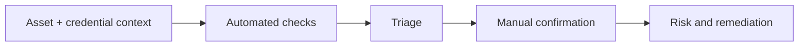

# Vulnerability Assessment Tools

Products for signature/template checks, authenticated posture assessment, exploit intelligence lookup, and reproducible validation.



- [[Nuclei]]
- [[Nessus]]
- [[OpenVAS]]
- [[SearchSploit]]

```shell-session
analyst@lab:~$ printf '%s\n' scanner-observation manual-status asset-owner > triage-fields.txt
analyst@lab:~$ paste -sd, triage-fields.txt
scanner-observation,manual-status,asset-owner
```

---
> 🔼 Up: [[Offensive Tools]]
