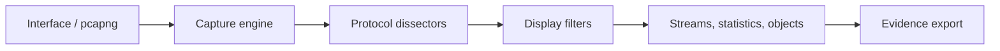

# Wireshark

Wireshark is an interactive protocol analyzer built on libpcap/Npcap capture and a large dissector ecosystem. It turns frames into protocol fields, conversations, streams, expert information, and exported objects while preserving access to raw bytes.



## Installation & capture privileges

```shell-session
analyst@lab:~$ sudo apt install wireshark
analyst@lab:~$ tshark --version | head -n 2
TShark (Wireshark) 4.x
Compiled (64-bit) using GCC ...
```

Avoid running the GUI as root. On Linux, delegate packet capture to `dumpcap` through the distribution’s capture group/capabilities. On Windows install Npcap from a trusted source. Record interface, snap length, promiscuous/monitor mode, timestamp precision, capture loss, and time synchronization.

## Capture filters vs display filters

Capture filters use BPF and decide which packets are retained:

```text
host 192.0.2.10 and tcp port 443
net 192.0.2.0/24 and not broadcast
udp port 53
```

Display filters operate on decoded fields after capture:

```text
ip.addr == 192.0.2.10 && tcp.port == 443
http.request.method == "POST"
dns.flags.response == 0 && dns.qry.type == 1
tcp.analysis.retransmission
tls.handshake.type == 1
```

Use `==`, `!=`, `contains`, `matches`, set membership, slices, and field existence. Parentheses make precedence explicit.

## Core workflows

| Workflow | Menu / technique |
|---|---|
| Conversation triage | Statistics → Endpoints / Conversations |
| Time pattern | Statistics → I/O Graphs |
| TCP behavior | Analyze → Expert Information, TCP analysis fields |
| Session reconstruction | Follow TCP/UDP/HTTP/HTTP2 stream |
| Object extraction | File → Export Objects for supported protocols |
| Field export | Apply filter, select columns, export CSV/JSON via TShark |
| Name resolution | Disable for evidence purity; enable deliberately with provenance |
| Decryption | TLS key log or approved keys; protect decrypted capture as sensitive data |

## TShark automation

```shell-session
analyst@lab:~$ tshark -r incident.pcapng -Y 'dns.flags.response == 0' \
  -T fields -e frame.time_epoch -e ip.src -e dns.qry.name -E header=y -E separator=,
frame.time_epoch,ip.src,dns.qry.name
1785405901.187201,192.0.2.44,updates.example.test
```

Useful flags include `-i` interface, `-D` list interfaces, `-f` capture filter, `-Y` display filter, `-a` autostop, `-b` ring buffer, `-s` snap length, `-w` raw capture, `-r` read file, `-T` output format, `-e` fields, `-z` statistics, `-q`, `-V`, `-o` preferences, and `-d` decode-as.

## Evidence discipline

Keep the original pcapng read-only, analyze a copy, hash both, and record the filter/export command. Displayed protocol labels are dissector interpretations; verify critical claims against frame bytes and endpoint logs. Captures may contain credentials, personal data, and session tokens, so minimize collection and control access.

## Protocol-analysis methodology

Start broad with endpoints, conversations, protocol hierarchy, and I/O graphs. Form a hypothesis, narrow with a display filter, follow the relevant stream, inspect expert information, then return to raw frames. Never begin by searching for a dramatic string without first establishing capture boundaries and normal traffic.

For TCP, examine handshake, negotiated options, sequence/acknowledgment behavior, window scaling, retransmissions, out-of-order packets, zero windows, resets, and teardown. Distinguish retransmission from capture loss. For DNS, correlate query ID, name, type, response code, answers, TTL, and retransmission. For TLS, inspect ClientHello/ServerHello, versions, cipher suites, SNI, ALPN, certificate chain, session resumption, and alerts.

## Profiles, columns & decryption

Create separate profiles for incident response, application troubleshooting, wireless, and malware analysis. Useful columns include `tcp.stream`, `tcp.analysis.flags`, `dns.qry.name`, `http.request.method`, `tls.handshake.extensions_server_name`, and `frame.time_delta_displayed`.

TLS session-key logging can decrypt approved client traffic when supported. Protect key logs like credentials and verify decrypted application records. RSA private keys generally cannot decrypt modern forward-secret sessions. IPsec, Kerberos, and wireless decryption require protocol-specific keys and complete exchanges.

## Mastery lab

Capture a controlled DNS lookup and HTTPS request. Produce capture metadata, endpoint/conversation summary, DNS transaction explanation, TCP handshake/teardown sequence, TLS negotiation table, approved decrypted HTTP evidence, and a timeline joined to server logs.

```shell-session
analyst@lab:~$ capinfos evidence.pcapng | sed -n '1,8p'
File type:           Wireshark/... - pcapng
Number of packets:   184
Capture duration:    2.481 seconds
Data byte rate:      18 kBps
```

Wrong checksums often result from NIC offload. Missing one direction suggests SPAN/TAP asymmetry, routing, VLAN, or placement. An unrecognized protocol may require Decode As, a newer dissector, or confirmation that traffic is encrypted/proprietary.

---
> 🔼 Up: [[Packet Analysis Tools]]
