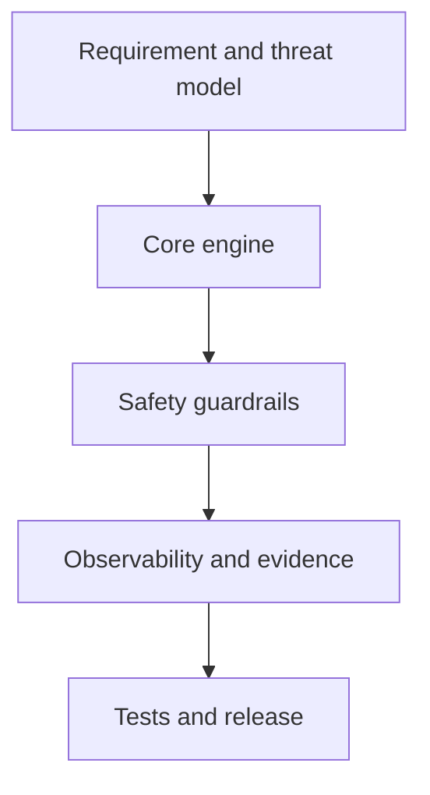

# Writing Your Own Tools

> [!abstract] Build instead of merely consume
> Architecture, safety controls, packaging, telemetry, and maintainability for security utilities.



## Engineering paths

- [[Security Tool Architecture & Design Patterns]]
- [[Building Network Scanners]]
- [[Command & Control Design Principles]]
- [[Hashsmith Tool Architecture]]
- [[ShadowStep Tool Architecture]]

## Minimum release gate

```text
[ ] explicit scope input       [ ] bounded concurrency
[ ] deterministic exit codes  [ ] structured audit log
[ ] dry-run mode               [ ] unit/integration tests
[ ] package signature/checksum [ ] documented rollback
```

---
> 🔼 Up: [[Tooling]]
