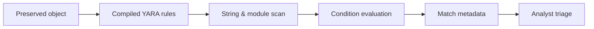

# YARA

YARA classifies files, memory images, and byte streams using strings, structural conditions, metadata, and modules. It should identify a meaningful family or behavior—not merely one common byte sequence.



## Installation & CLI

```shell-session
analyst@lab:~$ sudo apt install yara
analyst@lab:~$ yara --version
4.x
```

Common options include `-r` recursive, `-f` fast scan, `-w` suppress warnings, `-s` print matching strings, `-m` metadata, `-g` tags, `-n` negate result, `-t tag`, `-i identifier`, `-x module=data`, `-d name=value` external variable, `-p` threads, `-a` timeout, `-C` compiled rules, and `--max-rules`/stack controls depending on version. `yarac` compiles rule sets for validation and faster distribution.

## High-quality rule example

```yara
rule C2R_Training_Document_Marker : training document
{
  meta:
    author = "Detection Engineering"
    purpose = "Authorized canary validation"
    version = "1.0"
  strings:
    $marker = "C2R-TRAINING-DOCUMENT" ascii wide
    $xml = "[Content_Types].xml" ascii
    $macro = "vbaProject.bin" ascii
  condition:
    filesize < 20MB and $marker and $xml and $macro
}
```

```shell-session
analyst@lab:~$ yarac rules/c2r-training.yar build/c2r-training.yarc
analyst@lab:~$ yara -C -s -m build/c2r-training.yarc samples/canary.docm
C2R_Training_Document_Marker [author="Detection Engineering",purpose="Authorized canary validation"] samples/canary.docm
0x18f2:$marker: C2R-TRAINING-DOCUMENT
```

## String & condition mastery

Strings may be text, hexadecimal patterns with wildcards/jumps/alternatives, or regular expressions. Modifiers include `ascii`, `wide`, `nocase`, `fullword`, `xor`, and `base64` variants where supported. Conditions can use counts (`#a`), offsets (`@a[1]`), lengths (`!a[1]`), ranges, `for any/all`, file size, entry point, and modules such as PE, ELF, hash, math, dotnet, or time.

Avoid fragile rules built from packer stubs, compiler artifacts, or one public string. Select multiple independent features, use structural checks, and test against a large benign corpus. Measure precision, recall, scan time, and maximum object size. Rules that time out or cause excessive endpoint CPU are operational defects.

## Deployment

Sign/version bundles, compile in CI, validate syntax, test positives/near-misses/benign corpora, and record rule provenance. Preserve original sample hashes and do not execute unknown objects. A YARA match is a triage classification, not automatic proof of maliciousness.

---
> 🔼 Up: [[Malware & Content Analysis Tools]]
