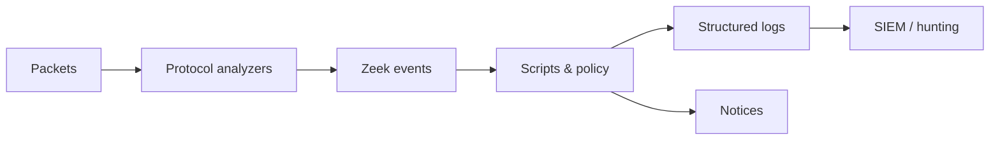

# Zeek

Zeek is an event-driven network analysis framework. Rather than centering on signatures, it interprets protocols and produces correlated logs such as `conn.log`, `dns.log`, `http.log`, `ssl.log`, `files.log`, and `notice.log`.



## Installation & offline analysis

```shell-session
analyst@lab:~$ zeek --version
zeek version 7.x
analyst@lab:~/case$ zeek -Cr ../incident.pcap local
analyst@lab:~/case$ ls *.log
conn.log  dns.log  files.log  http.log  packet_filter.log  weird.log
```

`-r` reads a capture, `-C` ignores invalid checksums often caused by capture offload, `-i` selects a live interface, `-f` supplies a capture filter, `-e` evaluates script text, `-b` bare mode, `-N` lists plugins, `-NN` analyzers, and `zeek-config` reports build paths/options. Use `zeekctl` or an orchestrator for managed sensors.

## Log model & UIDs

`conn.log` is the backbone. Its `uid` correlates a connection with DNS/HTTP/TLS/file records. Key fields include origin/responder addresses and ports, protocol, service, duration, bytes, connection state, history, packet counts, and tunnel parents.

```shell-session
analyst@lab:~/case$ zeek-cut ts uid id.orig_h id.resp_h id.resp_p service duration conn_state < conn.log | head
1785405901.187201 Cc2r01 192.0.2.44 192.0.2.10 443 ssl 1.847 SF
analyst@lab:~/case$ zeek-cut uid query qtype_name answers < dns.log | head
Cdns01 updates.example.test A 192.0.2.10
```

Connection states such as `S0`, `S1`, `SF`, `REJ`, `RSTO`, and `RSTR` describe observed handshake/teardown behavior; packet loss or asymmetric visibility can change interpretation.

## Zeek scripting

```zeek
@load base/frameworks/notice

module C2R;

export {
  redef enum Notice::Type += { Training_Marker };
}

event http_request(c: connection, method: string, original_URI: string,
                   unescaped_URI: string, version: string)
  {
  if ( "/c2r-training-marker" in unescaped_URI )
    NOTICE([$note=Training_Marker,
            $msg=fmt("Authorized marker from %s", c$id$orig_h),
            $conn=c]);
  }
```

```shell-session
analyst@lab:~/case$ zeek -Cr ../c2r-marker.pcap c2r-marker.zeek
analyst@lab:~/case$ zeek-cut ts note msg < notice.log
1785405901.187201 C2R::Training_Marker Authorized marker from 192.0.2.44
```

Zeek language supports events, hooks, functions, records, tables/sets, schedules, logs, and package-loaded scripts. Avoid expensive per-packet logic when an analyzer event suffices.

## Deployment & quality

Cluster roles include manager, proxy, worker, and logger depending on architecture/version. Engineer packet distribution so both directions of a flow reach the same worker. Monitor capture loss, worker load, analyzer gaps, `weird.log`, log queue/backpressure, disk, and clock synchronization. Use JSON logs where the pipeline benefits, but retain schema/version metadata.

Test scripts with packet fixtures, lint/type-check through Zeek, benchmark replay, and validate expected logs—not only notices. Protocol logs are observations from visible traffic; encrypted or asymmetric flows can limit conclusions.

## Event-driven reasoning

Zeek raises events as analyzers interpret connections. Scripts subscribe, update state, write logs, or generate notices. This separates parsing from policy. Inspect existing events/frameworks before duplicating parser work.

Tables and sets can expire entries; schedules defer work; SumStats supports distributed aggregation. Notice policy controls suppression/actions. Intel and files frameworks provide shared enrichment and extraction patterns.

## Cluster architecture

Workers analyze packets, proxies coordinate shared state, managers control configuration, and loggers handle output in common deployments. Load balancing must preserve flow affinity. Cluster scripts need Broker-aware semantics; local tables do not become global automatically.

## Correlation

Use `uid` and Community ID to join connection, DNS, HTTP, TLS, file, and external records. File IDs correlate protocol delivery with hashes, MIME types, extraction, and analyzers.

```shell-session
analyst@case:~$ zeek-cut uid id.orig_h id.resp_h service < conn.log | rg '^Cc2r01'
Cc2r01 192.0.2.44 192.0.2.10 ssl
analyst@case:~$ zeek-cut uid server_name < ssl.log | rg '^Cc2r01'
Cc2r01 app.example.test
```

## Mastery lab

Replay DNS, HTTP, TLS, and malformed transactions. Explain every log, correlate by UID, write a typed custom log field, raise a Notice on a marker, and benchmark the script. Repeat with one direction removed and document inference loss.

Missing logs require protocol/analyzer/visibility/checksum review. High `weird.log` volume can mean malformed traffic, loss, or parser limits. Cluster imbalance points to flow distribution. Script type errors must fail CI.

---
> 🔼 Up: [[Network Detection & Monitoring Tools]]
