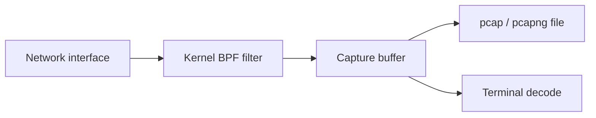

# tcpdump

tcpdump is a command-line libpcap capture and decoder. It is ideal for remote servers, short incident captures, ring buffers, and precise BPF filtering.



## Installation & interface discovery

```shell-session
analyst@sensor:~$ sudo apt install tcpdump
analyst@sensor:~$ tcpdump --version | head -n 1
tcpdump version 4.99.x
analyst@sensor:~$ tcpdump -D
1.eth0 [Up, Running, Connected]
2.any (Pseudo-device that captures on all interfaces)
```

## Essential options

| Area | Options |
|---|---|
| Interface | `-i`, `-D`, `-Q in|out|inout`, `--direction` where supported |
| Files | `-w`, `-r`, `-c` packet count, `-C` size rotation, `-G` time rotation, `-W` file count |
| Decode | `-n`, `-nn`, `-v/-vv/-vvv`, `-e`, `-q`, `-S`, `-K`, `-t/-tt/-tttt` |
| Payload | `-s` snap length, `-A` ASCII, `-X` hex+ASCII, `-x/-xx` hex |
| Buffering | `-B` buffer KiB, `-l` line buffered, `-U` packet buffered |
| Privilege | `-Z user`, capability-based capture where supported |

## BPF grammar

Primitives combine type (`host`, `net`, `port`, `portrange`), direction (`src`, `dst`), and protocol (`ether`, `ip`, `ip6`, `tcp`, `udp`, `icmp`). Use `and`, `or`, `not`, and parentheses.

```bash
tcpdump -ni eth0 'host 192.0.2.10 and (tcp port 443 or udp port 53)'
tcpdump -ni any 'tcp[tcpflags] & (tcp-syn|tcp-ack) == tcp-syn'
tcpdump -ni eth0 'icmp or icmp6'
```

## Incident ring buffer

```shell-session
analyst@sensor:~$ sudo tcpdump -ni eth0 -s 0 -B 8192 \
  -w '/var/tmp/incident-%Y%m%d-%H%M%S.pcap' -G 300 -W 12 \
  'net 192.0.2.0/24 and not port 22'
tcpdump: listening on eth0, link-type EN10MB (Ethernet), snapshot length 262144 bytes
^C
18422 packets captured
18439 packets received by filter
0 packets dropped by kernel
```

This keeps twelve five-minute files. Excluding the management SSH flow prevents self-generated capture noise, but exclusions must not hide evidence relevant to the investigation.

## Reading & exporting

```shell-session
analyst@sensor:~$ tcpdump -nn -tttt -r incident-20260730-102000.pcap 'tcp port 443' | head
2026-07-30 10:20:01.187201 IP 192.0.2.44.51218 > 192.0.2.10.443: Flags [S], seq 101, win 64240, length 0
analyst@sensor:~$ sha256sum incident-20260730-102000.pcap
203c...  incident-20260730-102000.pcap
```

Check kernel drops at capture end. A small snap length can omit payload and headers; `-s 0` captures full packets but increases sensitive-data volume. Use `-nn` to avoid DNS/service-name ambiguity. Store original captures immutably and analyze copies.

---
> 🔼 Up: [[Packet Analysis Tools]]
